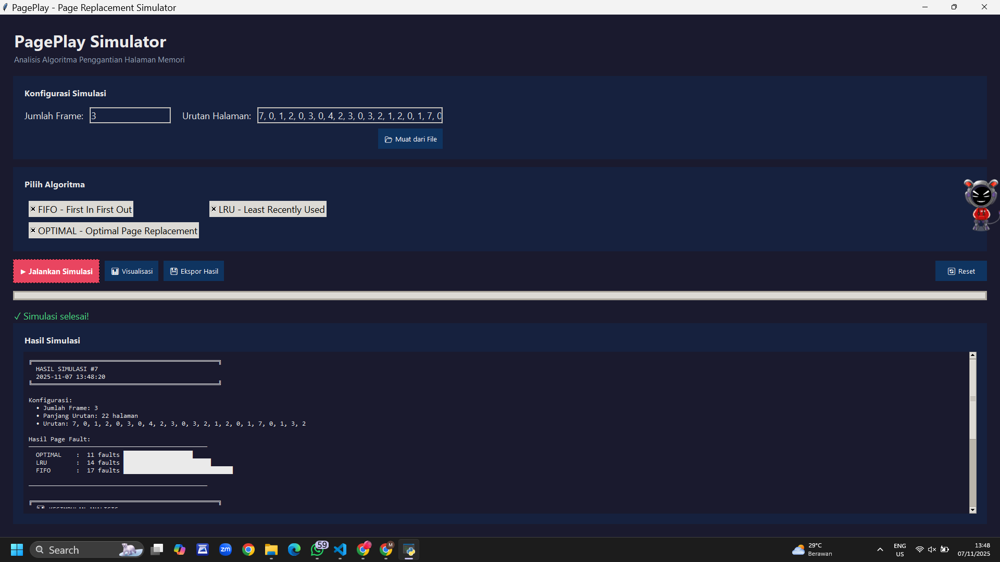

# 🧠 Page Replacement Simulator  
Projek Mata Kuliah **Sistem Operasi**

Simulasi ini dibuat untuk memvisualisasikan cara kerja beberapa algoritma **Page Replacement** seperti FIFO, LRU, dan Optimal. Program dapat menampilkan hasil simulasi dalam bentuk teks dan visualisasi grafik.

---

## 👥 Kelompok  4

### **Anggota:**
- **Najmi Sabila Almusfiroh**  
- **Muthia Febrahma Khoirunnisa**
- **Ismatul Ilmi**  
- **Siti Qori’ah Muhafidloh**  
- **Nabila Rohmatul Aulia**  
- **Wardah Nurwafiq**  

---
## 📌 Deskripsi Singkat
Project ini merupakan aplikasi simulasi page replacement untuk membantu memahami bagaimana Sistem Operasi mengelola **manajemen memori**, khususnya ketika page fault terjadi.  

Aplikasi ini menyediakan:  
- Input sequence halaman  
- Jumlah frame  
- Pemilihan algoritma (FIFO, LRU, Optimal)  
- Output berupa jumlah page fault  
- Visualisasi grafik menggunakan Matplotlib  
---




## 🚀 Fitur Utama
- 🔄 **Simulasi 3 algoritma** (FIFO, LRU, Optimal)  
- 📊 **Visualisasi Page Fault**  
- 🖥️ **GUI sederhana** (Tkinter)  
- 📁 **Tracking setiap langkah simulasi**  
- 🧪 **Modular (main.py, gui.py, simulation.py, visualization.py)**


## 🛠️ Cara Menjalankan
Pastikan Python sudah terinstall.

### 1. Install dependencies
```bash
pip install matplotlib

python main.py
```


